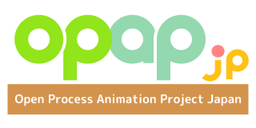

<section markdown="1">
<div class="row">
<div markdown="1" class="col-6 textblock">

</div>
<div markdown="1" class="col-6 textblock">
<heading>
<h2 class="post-title">――長く使われた物には魂が宿ると言いますが、このシステムに宿っていたのはゴミでした。</h2>
</heading>

ここは姫路と京都を結ぶ中堅私鉄、京姫鉄道株式会社。 その広報部システム課に配属された新入社員、祝園アカネ（ほうその　あかね）は、オフィスワークに喜んだのもつかの間……。今日も今日とてセキュリティトラブルにてんてこ舞い。大丈夫！？　私の会社のセキュリティ。

社内システムエンジニアの悲哀を描く技術系コメディが、ここに始まる！
</div>
</div>
</section>


<section markdown="1">

## 二次創作OK！ オープンソースのアニメーション作品

「こうしす！」オリジナルシリーズはすべてがフリー素材です。<br />
注記のない限り、映像も、音声も、[クリエイティブ・コモンズ表示 4.0 国際ライセンス](https://creativecommons.org/licenses/by/4.0/deed.ja)のもとに、ご自由にお使いいただけます。

さらに、完成品だけでなく、素材も公開しております。こうしす！は、日本でも数少ないオープンソースのアニメーション作品です。
わたしたちがこのような形で作品を公開するのは、価値のある情報をより多くの皆様にお届けするため、アニメ作りをもっと身近に感じていただくため、そして、何より皆で作って楽しめる作品とするためです。

もちろん商用利用にも制限はありません。そのまま頒布するもよし、二次作品を作るもよし、グッズを作るもよしです。
多くの皆様方にこの作品を知って頂き、そしてご活用いただけることこそが、本作品を盛り上げることに繋がります。もしよろしければ、あなたもぜひ。

なお、本作品をご使用いただく際には、以下の表示が必要です。

```
OPAP-JP contoributors
https://opap.jp/contributors
```
</section>

<section markdown="1">

## シリーズ

こうしす！には二つのシリーズがあります。

非営利目的で制作されるアニメ「こうしす！」オリジナルシリーズと、そこから派生した商用シリーズ「こうしす！EE（Enterprise Edition）」です。


<div class="row">
<div class="col-6 textblock">

<table class="table-series">
<colgroup>
<col class="col-item-name" />
<col class="col-item-value" />
</colgroup>
<thead>
<tr>
<th colspan="2">こうしす！オリジナルシリーズ</th>
</tr>
</thead>
<tbody>
<tr>
<th>非営利目的</th>
<td><i class="fas fa-check-circle check-yes"></i>
<div class="note">非営利目的</div></td>
</tr>
<tr>
<th>二次利用等</th>
<td><i class="fas fa-check-circle check-yes"></i>
<div class="note">原則CC-BY 4.0ライセンス適用</div></td>
</tr>
<tr>
<th>受託制作可否</th>
<td><i class="fas fa-times-circle check-no"></i>
<div class="note">税法上の収益事業を行わないため不可</div>
</td>
</tr>
<tr>
<th>グッズ等販売</th>
<td><i class="fas fa-times-circle check-no"></i>
<div class="note">税法上の収益事業を行わないため不可</div>
</td>
</tr>
<tr>
<th>制作団体</th>
<td>
<a href="https://opap.jp/">
</a>
</td>
</tr>
<tr>
<th>主な作品</th>
<td markdown="1" class="cell-work-list">
* アニメ版 こうしす！
</td>
</tr>
<tr>
<th>作品公式サイト</th>
<td>
<a href="https://kosys.opap.jp/">https://kosys.opap.jp/</a>
</td>
</tr>
</tbody>
</table>
</div>
<div class="col-6 textblock">
<table class="table-series">
<colgroup>
<col class="col-item-name" />
<col class="col-item-value" />
</colgroup>
<thead>
<tr>
<th colspan="2">こうしす！EE（Enterprise Edition）シリーズ</th>
</tr>
</thead>
<tbody>
<tr>
<th>非営利目的</th>
<td><i class="fas fa-times-circle check-no"></i>
<div class="note">営利目的</div></td>
</tr>
<tr>
<th>二次利用等</th>
<td><i class="fas fa-exclamation-triangle check-partial"></i>
<div class="note">一部のみCC-BY 4.0ライセンス適用</div>
</td>
</tr>
<tr>
<th>受託制作可否</th>
<td><i class="fas fa-check-circle check-yes"></i>
<div class="note">可能</div>
</td>
</tr>
<tr>
<th>グッズ等販売</th>
<td><i class="fas fa-check-circle check-yes"></i>
<div class="note">あり</div>
</td>
</tr>
<tr>
<th>制作団体</th>
<td>
<a href="https://www.kyoki-railway.co.jp/">

</a>
</td>
</tr>
<tr>
<th>主な作品</th>
<td markdown="1" class="cell-work-list">
* <a href="https://www.atmarkit.co.jp/ait/series/7144/">マンガ版 こうしす！ @IT支線</a>
* 小説版 こうしす！ 書籍（予定）
</td>
</tr>
<tr>
<th>作品公式サイト</th>
<td>
準備中
<div class="note"><a href="https://www.kyoki-railway.co.jp/products/">製品・サービス紹介ページはこちら</a></div>
</td>
</tr>
</tbody>
</table>
</div>

</div>
</section>